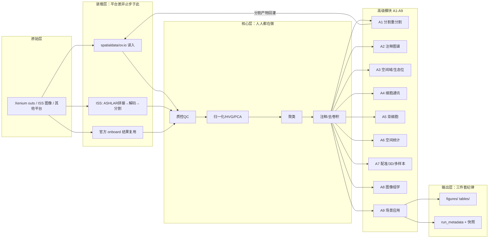

# 分类分析报告（一期）· 2026-09-04

> 对象：91 篇文献核验出的 **72 个 GitHub 仓库**（全部浅克隆锁定 SHA）+ 官方/OV 两条既有已验证线。
> 方法：72 仓全量档案卡（实测 README+代码结构）+ **S 级 27 仓深度精读**（7 维工程审计，逐条 文件:行号 证据）+ 46 张可搬运范式卡。
> 纪律：所有结论均有实读证据；不确定处标【待补充】。数字口径见各节说明。

---

## 0. 一句话结论

**文献伴随代码的共性骨架高度收敛（读取→QC→注释→空间统计是绝对主干），但工程质量普遍不及格（均值 8.3/14，仅 11% 达工业级）**——"范式主干有据可依、工程外壳必须自研"就是二期的组装依据：主干从文献蒸馏，外壳用我们自己已验证的纪律（run_metadata、seed 冻结、readiness→smoke→递进）。

## 1. 数据与方法

| 层 | 数量 | 产出 |
|---|---|---|
| 资源核验（上游种子，2026-09-04 冻结） | 634 条资源 | 其中代码类 114 条 = GitHub 76 行→**72 仓去重** + Zenodo 17 + 网页 21 |
| 全量浅克隆 | 72/72 成功（1 仓部分 checkout） | 总量约 5.8GB，SHA 全锁定 |
| 档案卡 | 72 张 | `01_资料库/档案卡/`（分类复核+license+复现难度） |
| S 级精读 | 27 仓 | `01_资料库/精读笔记/` 27 份 + `01_资料库/精读汇总.csv` |
| 工程审计 | 7 维×0-2 分 | 均分 **8.3/14** |
| 范式登记册 | 46 张 PATTERN 卡 | `02_工作流开发/范式登记册/` |

**License 红线实测**：72 仓中 **33 仓无 LICENSE**（仅可学习、不可转载）；另有 Stanford 非商业（SpatialEcoTyper）、GRL 非商业（drug2cell）、CC BY-NC（HoVer-Net PanNuke 权重）、UT Southwestern 学术专用（ImagePseudo）等限制性许可——这是"第三方代码只做本地镜像、公开仓以链接+SHA 引用"策略的直接依据。

## 2. 技术路线总图

三条装配路线（二期整合 pipeline 的三个来源支点）：
1. **官方线**（CPU 可复现基线）：SpatialData/Scanpy 全量重算 或 复用 onboard 结果（大样本稳妥路线）。
2. **OV 线**（GPU 规模化）：readiness→smoke→递进扩样 + strict GPU 校验，百万级已验证。
3. **文献线**（本库 72 仓）：提供装载层协议（ISS 工具链）、注释迁移链、niche 方法选型、配准链路等模块级参考。

## 3. 共性骨架与差异矩阵

### 3.1 步骤频次（27 个 S 仓精读路线还原，近似口径）

| 步骤 | 出现仓数/27 | 判定 |
|---|---|---|
| 数据读取 | 27 | **绝对主干** |
| 注释 | 27 | **绝对主干**（含规则/迁移/去卷积） |
| 导出 | 27 | **绝对主干**（对象/表格落盘） |
| 绘图 | 26 | 主干 |
| 聚类 | 25 | 主干 |
| 质控QC | 24 | 主干 |
| 归一化 | 24 | 主干 |
| 降维 | 24 | 主干 |
| 空间统计 | 24 | 高频 |
| HVG | 22 | 高频 |
| 细胞通讯 | 22 | 高频（多为 CellChat/LIANA 调用） |
| 亚细胞 | 21 | 高频（bin 级/转录本级） |
| 多样本整合 | 21 | 高频（Harmony/scVI 为主） |
| 去卷积 | 20 | 高频 |
| 空间邻域/域 | 20 | 高频 |
| 配准/3D | 16 | 中频（平台/问题依赖） |

> 口径说明：此表统计"技术路线还原小节中出现该步骤断言"的仓数，属近似（个别步骤可能在叙述中被提及而未真正执行）；用作主干/分叉判断足够，用作精确统计则需三期逐仓复核。

**共性骨架（≥24/27）＝ 范式主干候选**：`读取 → QC → 归一化(+HVG) → 降维 → 聚类 → 注释 → 绘图/导出`。这与官方线、OV 线完全同构——三线在此汇合，主干定版证据充分。

### 3.2 分叉点（按场景/平台裂变的步骤）

- **装载层三分**：Xenium outs 直读（spatialdata/ov.io）｜ISS 图像链（ASHLAR→解码→分割，Moldia 三件套）｜官方结果复用（大样本）。
- **注释两条路线**：百万细胞级 scVI→scANVI 半监督（crc-atlas）vs 少样本 scVI+celltypist 预训练直测+子集精修（crohns 三段式）——A2 模块建议以后者为主干、前者供大规模分支。
- **niche/生态型契约已定型**：`adata.obs 标签列 + 邻接矩阵` 为通用契约；CellCharter 系（delaunay→aggregate→AutoK）与 NMF 系（SpatialEcoTyper）并立，多候选并存（与我们的多候选纪律天然契合）。
- **配准三种做法**：官方 Explorer 人工配准+矩阵导出（janesick）、BigWarp/napari 3D 配准（mushroom）、HPC 管线托管（estorrs）——人工环节目前不可代码化，是明确断点。

### 3.3 集体缺位（= 迭代机会，二期重点）

1. **A4 细胞通讯在 72 仓中无专门仓库**（只有 SPACE 沾边、应用仓内 CellChat 调用）——生态工具（CellChat/LIANA+）补位，但空间特异的通讯验证方法缺位。
2. **注释的人工环节 4/5 应用仓不可纯代码复现**（TRM、UCSF、tnbc、Kidney 均断档）——需要显式的"注释计划-验证痕迹"协议（我们的注释列契约正好补位）。
3. **QC 指标不统一**：各仓自定义阈值/指标（唯一专门 QC 仓 SpatialQM 提供了可搬的指标定义层）。
4. **错误处理普遍缺失/吞异常**；编排层复制粘贴 bug 高发（基准组 5 仓中 4 仓实读出真 bug）。
5. **无 seed / 无 CI 测试**：27 仓中仅 snp2cell 有像样回归测试、SpatialQM 有 CI（33 行）。

## 4. 工程质量审计总结论

### 4.1 分数分布（27 仓，7 维×0-2=14 满分）

| 档 | 仓数 | 代表 |
|---|---|---|
| ≥12 工业级 | **3（11%）** | snp2cell 13、sharp 13、hover_net 12 |
| 10-11 良好 | 5 | spatialecotyper 11、drug2cell 10、multiplex 10、TRM 10、janesick 10 |
| 8-9 及格 | 8 | SpatialQM、ist_benchmarking、mushroom、crc-atlas、p53、SPACE、tnbc、UCSF |
| 6-7 欠佳 | 8 | ST_Comparison、Xenium_benchmarking、SpatialBenchmarking、ISS_decoding、crohns、3d-analysis、Kidney |
| ≤5 不可直接用 | 3 | ISS_postprocessing 4、ImagePseudo 5、SPATCH 5 |

**均值 8.3/14（59%）**。与既有认知一致：**方法可信、软件不可用**（手稿仓派）与**外壳成熟、内核粗糙**（TRM 的 pixi 外壳 vs 裸 except 内核）两极并存。

### 4.2 共性硬伤 TOP5（搬运前必须清创）

1. **硬编码作者机路径**（`/mnt/sata1`、`~/`、`/data/projects/robin/`、`/scratch`）——5 个精读批次全部报出，0 分维度集中地。
2. **无 seed / 无版本锁**（KFold 无 seed、torch 不设 seed、requirements 与实际漂移）。
3. **import 副作用**（ISS_postprocessing `segmentation.py:10,124` import 即实例化 Cellpose，无网环境卡死；Xenium_benchmarking `__init__.py` 语法非法）。
4. **开箱即坏的依赖冲突**（ImagePseudo `scipy.misc` vs `scipy==1.12.0` 实锤；torch1.6/CUDA10.2 老栈）。
5. **编排层复制粘贴 bug**（ST_Comparison 4 处语法/复制粘贴错误＝未运行过的论文附件；SpatialBenchmarking 路径漏"/"）。

### 4.3 superpowers / SOLID 式成分：**结论=普遍缺失，但亮点可数**

- 有：snp2cell 的 seed 三表+置换检验+CI 回归；sharp 的配置-代码-容器-校验四分离；ist_benchmarking 的幂等检查点+常量中心；QuKunLab 的统一 CLI 契约+注册表分派；TRM 的产数/出图双层；tnbc 的 md 手册四段式验收（图号→脚本→步骤→预期输出）+`.winner` 终版命名。
- **没有**任何一仓具备完整的"计划→实现→验证"工作流痕迹（superpowers 式）；SOLID 长期实践者仅 snp2cell/sharp 两例。
- **这正是二期自研标准的固化清单**（见 §8）：文献界没给的工程外壳，用我们已验证的 zoro 纪律 + 登记册 46 卡补齐。

## 5. 分类工具对比（P0-P8 主推与备选）

| 类 | 主推参考 | 备选/对照 | 一期证据要点 |
|---|---|---|---|
| P0 基准质控 | ist_benchmarking（装载层最纯）+ QuKunLab（CLI 契约） | SpatialQM（指标定义层）、Moldia/Xenium_benchmarking（任务号 notebook+xb 包） | 平台差异止步装载层；单指标单函数；manifest 快照 |
| P1 分割 | **hover_net（工业级蓝本）** | mushroom（3D 配准架构最佳）、iss_patcher（补基因小工具） | 分割加载严禁 import 副作用（PATTERN-013） |
| P2 注释图谱 | **crohns 三段式**（celltypist+CellCharter Xenium 5K 链） | crc-atlas（Nextflow 百万级）、spatialecotyper（NMF 生态型 R 包） | 注释列契约直接模板 |
| P3 空间域 | CellCharter 系契约（crohns/p53 实例）+ SPACE（最小 GAE 包） | SpatialEcoTyper、CoCo-ST | `obs 标签+邻接矩阵`契约定型 |
| P4 通讯 | （生态工具 CellChat/LIANA，无文献专仓） | COPD 仓 LocalMoran.R 小工具 | **缺位即机会** |
| P5 亚细胞 | drug2cell（scanpy 挂件范本） | snp2cell（GRN 传播，工程标杆） | uns 存回约定可吸收 |
| P6 配准/3D | janesick 官方配准链（凸包过滤+KDTree 插值） | mushroom BigWarp、3d-analysis | 人工配准是断点 |
| P7 图像组学 | multiplex-imaging-pipeline（CLI+CWL+门控 JSON） | ImagePseudo（思路可取工程粗糙）、sc_MTOP | 声明式门控+固定输出契约 |
| P8 应用范式 | **UCSF colitis（跨平台泛化 QC 层）+ TRM（双层结构）** | tnbc（md 手册验收）、Kidney-Map（niche 全家桶） | UC 课题第一参照=UCSF 仓 |

## 6. 72 仓 × 官方线 × OV 线：互补关系

| 维度 | 官方线 | OV 线 | 72 仓 |
|---|---|---|---|
| 定位 | 可复现基线/教学 | 规模化引擎 | 模块级参考与场景叙事 |
| 与官方结果可比 | ★ | △ | ✕ |
| 百万级能力 | 复用模式可行 | ★ 已验证 | crc-atlas Nextflow 思路 |
| 工程纪律 | 中（config+metadata） | ★（三件套审计） | 低（均值 8.3/14） |
| 独有价值 | 中文文档全 | GPU 固化参数/补丁 | ISS 链、注释链、配准链、手册范式 |

**结论**：三者不是竞争关系——二期整合 pipeline = 官方线的可比性 + OV 线的执行纪律 + 文献仓的模块精华。

## 7. 避坑清单汇总（一期新增部分，沿用 ov工作流测试既有坑位）

**环境**：torch1.6/CUDA10.2 与 torch==1.5.0 老栈难复现；scipy.misc 与 scipy≥1.10 冲突；annoy/javabridge Windows 编译失败（走 WSL）；cupy/cuml Windows 不可用（WSL2）；pybiomart/pybiomart 类需联网；presto 装机可能要 GITHUB_PAT。
**克隆**：尾随空格目录名 Windows 无法 checkout（IN-DEPTH 案例，sparse-checkout 绕过）；submodule 仓需 `--recursive`（Xenium_benchmarking、mip）；Google Drive/Synapse/DUA 申请的数据不在仓内。
**代码**：import 即实例化模型（无网卡死）；同名函数冲突（SPATCH）；"MLE 推断"名不副实（janesick 实为比例归一化）；论文附件代码可能从未运行过（ST_Comparison 4 处语法错误）。
**许可**：33/72 无 LICENSE；限制性许可四例（Stanford/GRL/CC BY-NC/UTSW）——引用与搬运前逐仓核对档案卡。
**数据**：`glob('output*')` 就地读目录（apoe 仓）；RData 散放 744MB；`rm(list=ls())`+相对路径（LungPCA）。

## 8. 二期整合 pipeline 组装建议（草案，待用户终审）

**五层骨架**（每层注来源）：
1. **装载层**：spatialdata/ov.io 直读 + ISS 链协议（PATTERN-016/017/018）+ 官方结果复用模式（大样本分支）。
2. **质控层**：统一 QC 核心 + 平台补丁层（PATTERN-047，UCSF）+ 指标定义层（SpatialQM PATTERN-001/002）。
3. **核心层**：官方线主干（已跑通）+ seed 三表（PATTERN-023 crc-atlas）+ locked 冻结命名（PATTERN-028 p53）。
4. **模块层**：A1 hover_net 蓝本；A2 crohns 三段式；A3 CellCharter 契约；A7 janesick 配准链；A8 mip 门控 JSON。
5. **外壳层（自研固化）**：sharp 四分离配置 + TRM 产数/出图双层 + tnbc md 四段式验收 + run_metadata 三件套 + readiness→smoke→递进。

**组装原则**：每模块记录选型理由与落选者；基础流程（CPU）与规模化分支（WSL GPU）双轨；实质变更升版本。

## 9. 待人工核验清单

1. QuKunLab/SpatialBenchmarking 的 LIT-088 映射存疑（README 自引 Li et al. 2022 整合基准文）——核对文献 PDF。
2. atlasxomics/ATX_epigenomics 与 LIT-039 的映射（仓内未见皮肤癌代码，疑平台管线）。
3. natsuhiko/PHM 非空间仓（统计遗传方法）——终审去留。
4. ding-lab/10Xmapping 归类矛盾（P6 vs 实际变异映射功能）。
5. moldia/xenium_benchmarking 内 Banksy_py submodule 未递归克隆——如需可用 `git submodule update --init`。
