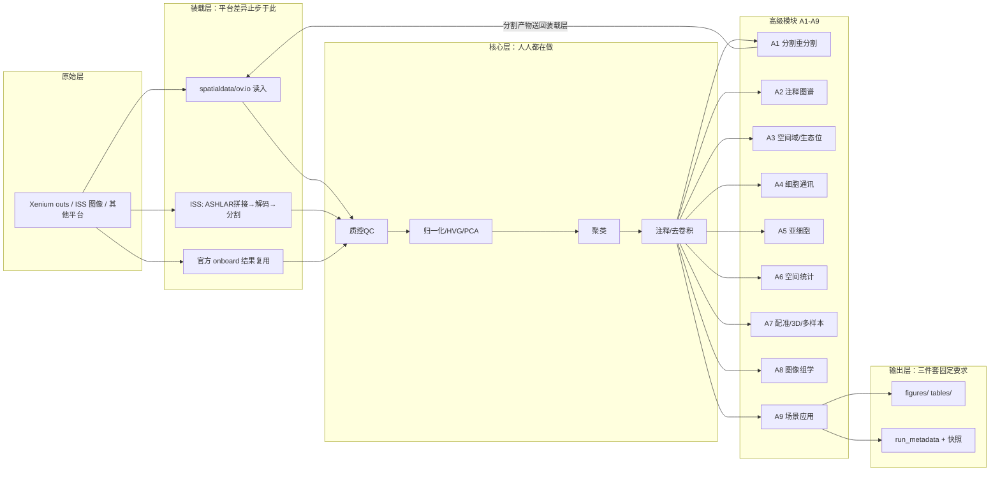

# 分类分析报告（一期）· 2026-09-04

> 对象：91 篇文献核验出的 **72 个 GitHub 仓库**（全部浅克隆并锁定 SHA），外加官方/OV 两条已验证的既有路线。
> 方法：为全部 72 仓建档案卡（实测 README+代码结构）+ **S 级 27 仓深度精读**（7 维工程审计，每条评分附 文件:行号 证据）+ 46 张可照搬的做法卡。
> 固定要求：所有结论都有实读证据；不确定处标【待补充】。数字的统计方式见各节说明。

---

## 0. 一句话结论

**这批论文附带的代码流程高度相似**，基本都是读数据、质控、注释、空间统计这几步；**但代码质量普遍不高**（满分 14 平均 8.3，达到工业水准的仅 11%）。二期的工作因此分两块：分析步骤照论文代码学（这部分有依据），配套管理（记录元数据、固定随机种子、由小到大测试）用我们自己已经验证过的固定做法。

## 1. 数据与方法

| 层 | 数量 | 产出 |
|---|---|---|
| 资源核验（最初来源清单，2026-09-04 定稿） | 634 条资源 | 其中代码类 114 条：GitHub 76 行去重后 **72 仓** + Zenodo 17 + 网页 21 |
| 全部浅克隆 | 72/72 成功（1 仓部分 checkout） | 总量约 5.8GB，SHA 全锁定 |
| 档案卡 | 72 张 | `01_资料库/档案卡/`（分类复核+license+复现难度） |
| S 级精读 | 27 仓 | `01_资料库/精读笔记/` 27 份 + `01_资料库/精读汇总.csv` |
| 工程审计 | 7 维×0-2 分 | 均分 **8.3/14** |
| 做法登记册 | 46 张 PATTERN 卡 | `02_工作流开发/做法登记册/` |

**License 限制实测**：72 仓中 **33 仓无 LICENSE**（仅可学习、不可转载）；另有 Stanford 非商业（SpatialEcoTyper）、GRL 非商业（drug2cell）、CC BY-NC（HoVer-Net PanNuke 权重）、UT Southwestern 学术专用（ImagePseudo）等限制性许可。这就是"第三方代码只做本地镜像、公开仓以链接+SHA 引用"策略的直接依据。

## 2. 技术路线总图

```mermaid
flowchart LR
    subgraph 原始层
        A[Xenium outs / ISS 图像 / 其他平台]
    end
    subgraph 装载层[装载层：平台差异止步于此]
        B1[spatialdata/ov.io 读入]
        B2[ISS: ASHLAR拼接→解码→分割]
        B3[官方 onboard 结果复用]
    end
    subgraph 核心层[核心层：人人都在做]
        C1[质控QC] --> C2[归一化/HVG/PCA] --> C3[聚类] --> C4[注释/去卷积]
    end
    subgraph 模块层[高级模块 A1-A9]
        D1[A1 分割重分割]
        D2[A2 注释图谱]
        D3[A3 空间域/生态位]
        D4[A4 细胞通讯]
        D5[A5 亚细胞]
        D6[A6 空间统计]
        D7[A7 配准/3D/多样本]
        D8[A8 图像组学]
        D9[A9 场景应用]
    end
    subgraph 输出层[输出层：三件套固定要求]
        E1[figures/ tables/]
        E2[run_metadata + 快照]
    end
    A --> B1 & B2 & B3 --> C1
    C4 --> D1 & D2 & D3 & D4 & D5 & D6 & D7 & D8 & D9
    D1--分割产物送回装载层-->B1
    D9 --> E1 & E2
```

三条拼装路线（二期整合流程的三个来源）：
1. **官方线**（CPU 可复现基线）：用 SpatialData/Scanpy 从头重算，或复用官方 onboard 结果（大样本时更稳妥）。
2. **OV 线**（GPU 规模化）：先 readiness、再 smoke、然后逐级扩大样本，并做 strict GPU 校验；百万级已验证。
3. **文献线**（本库 72 仓）：提供装载层怎么读数据（ISS 工具链）、注释怎么迁移、niche 方法怎么选、配准怎么做等模块级参考。

## 3. 共性框架与差异矩阵

### 3.1 步骤频次（27 个 S 级仓精读还原技术路线，近似统计）

| 步骤 | 出现仓数/27 | 判定 |
|---|---|---|
| 数据读取 | 27 | **主流程必备** |
| 注释 | 27 | **主流程必备**（含规则/迁移/去卷积） |
| 导出 | 27 | **主流程必备**（对象/表格保存到本地） |
| 绘图 | 26 | 主流程 |
| 聚类 | 25 | 主流程 |
| 质控QC | 24 | 主流程 |
| 归一化 | 24 | 主流程 |
| 降维 | 24 | 主流程 |
| 空间统计 | 24 | 高频 |
| HVG | 22 | 高频 |
| 细胞通讯 | 22 | 高频（多为 CellChat/LIANA 调用） |
| 亚细胞 | 21 | 高频（bin 级/转录本级） |
| 多样本整合 | 21 | 高频（Harmony/scVI 为主） |
| 去卷积 | 20 | 高频 |
| 空间邻域/域 | 20 | 高频 |
| 配准/3D | 16 | 中频（取决于平台和研究问题） |

> 统计方式说明：此表统计的是"技术路线还原小节中出现了该步骤断言"的仓数，属近似（个别步骤可能在叙述中被提到而未真正执行）；用来判断主流程与分叉够用了，要做精确统计需三期逐仓复核。

**共性框架（≥24/27）＝ 候选主流程**：`读取 → QC → 归一化(+HVG) → 降维 → 聚类 → 注释 → 绘图/导出`。这条流程与官方线、OV 线的结构完全一致。三条线在这里汇合，把它定为正式主流程的证据充分。

### 3.2 分叉点（因场景或平台不同而分化的步骤）

- **装载层分三条**：Xenium outs 直读（spatialdata/ov.io）｜ISS 图像流程（ASHLAR→解码→分割，Moldia 三件套）｜官方结果复用（大样本）。
- **注释两条路线**：百万细胞级用 scVI 接 scANVI 做半监督（crc-atlas）；少样本用 scVI+celltypist 预训练模型直测，再加子集精修（crohns 三段式）。A2 模块建议以少样本直测这条路线为主流程，百万细胞路线用于大规模分支。
- **niche/生态型的输出约定已定型**：通用格式是 `adata.obs 标签列 + 邻接矩阵`；CellCharter 系（delaunay→aggregate→AutoK）与 NMF 系（SpatialEcoTyper）两套方法并立，候选不止一个（与我们的多候选固定做法天然契合）。
- **配准三种做法**：官方 Explorer 人工配准+矩阵导出（janesick）、BigWarp/napari 3D 配准（mushroom）、HPC 管线托管（estorrs）。人工环节目前没有代码替代方案，是整条流程里明确的一处断档。

### 3.3 共同缺失（= 可改进处，二期重点）

1. **A4 细胞通讯在 72 仓中没有专门仓库**（只有 SPACE 沾边，另有一些应用仓调用 CellChat）。生态工具（CellChat/LIANA+）能补上通用分析，但空间特异的通讯验证方法仍然缺失。
2. **注释的人工环节在 5 个应用仓中有 4 个无法纯代码复现**（TRM、UCSF、tnbc、Kidney 都断档）。这需要一套明确的"注释计划加验证记录"协议（我们的注释列约定正好补上这个空缺）。
3. **QC 指标不统一**：各仓自定义阈值/指标（唯一专门做 QC 的仓 SpatialQM 提供了可照搬的指标定义层）。
4. **错误处理普遍缺失或悄悄吞掉报错**；流程串接脚本里复制粘贴 bug 高发（基准组 5 仓中 4 仓实读出真 bug）。
5. **无 seed / 无 CI 测试**：27 仓中仅 snp2cell 有像样回归测试、SpatialQM 有 CI（33 行）。

## 4. 工程质量审计总结论

### 4.1 分数分布（27 仓，7 维×0-2=14 满分）

| 档 | 仓数 | 代表 |
|---|---|---|
| ≥12 工业级 | **3（11%）** | snp2cell 13、sharp 13、hover_net 12 |
| 10-11 良好 | 5 | spatialecotyper 11、drug2cell 10、multiplex 10、TRM 10、janesick 10 |
| 8-9 及格 | 8 | SpatialQM、ist_benchmarking、mushroom、crc-atlas、p53、SPACE、tnbc、UCSF |
| 6-7 欠佳 | 8 | ST_Comparison、Xenium_benchmarking、SpatialBenchmarking、ISS_decoding、crohns、3d-analysis、Kidney |
| ≤5 不可直接用 | 3 | ISS_postprocessing 4、ImagePseudo 5、SPATCH 5 |

**均值 8.3/14（59%）**。与既有认知一致，两种极端并存：一种是**方法可信、软件不可用**（手稿附带代码的仓常见），另一种是**配套管理成熟、核心代码粗糙**（TRM 用 pixi 管环境很规范，代码主体里却到处是不写错误类型的 except）。

### 4.2 共性硬伤 TOP5（照搬前必须先清理修复）

1. **硬编码作者机路径**（`/mnt/sata1`、`~/`、`/data/projects/robin/`、`/scratch`）。5 个精读批次全部报出，是 0 分维度最集中的地方。
2. **无 seed / 无版本锁**（KFold 无 seed、torch 不设 seed、requirements 与实际环境脱节）。
3. **import 副作用**（import 一执行就跑代码：ISS_postprocessing `segmentation.py:10,124` import 即实例化 Cellpose，断网环境下会卡死；Xenium_benchmarking `__init__.py` 语法非法）。
4. **开箱即坏的依赖冲突**（ImagePseudo 的 `scipy.misc` 与 `scipy==1.12.0` 冲突已实测确认；torch1.6/CUDA10.2 旧版本组合）。
5. **流程串接脚本复制粘贴 bug**（ST_Comparison 有 4 处语法/复制粘贴错误，等于一份从未运行过的论文附件；SpatialBenchmarking 路径少写一个"/"）。

### 4.3 superpowers / SOLID 式工程实践：**结论=普遍缺失，但亮点可数**

- 有：snp2cell 的 seed 三表+置换检验+CI 回归；sharp 的配置-代码-容器-校验四分离；ist_benchmarking 的幂等检查点+常量集中管理；QuKunLab 的统一 CLI 约定+注册表分派；TRM 的产数/出图双层；tnbc 的 md 手册四段式验收（图号→脚本→步骤→预期输出）+`.winner` 终版命名。
- **没有**任何一仓留下“从计划、实现到验证”三步都齐全的工作流记录（superpowers 式）；长期践行 SOLID 的仅 snp2cell/sharp 两例。
- **二期自研标准要定下来的就是这份清单**（见 §8）：文献界没有提供的工程配套管理，用我们已经验证的 zoro 固定要求和登记册里的 46 张卡补上。

## 5. 分类工具对比（P0-P8 主推与备选）

| 类 | 主推参考 | 备选/对照 | 一期证据要点 |
|---|---|---|---|
| P0 基准质控 | ist_benchmarking（装载层最纯）+ QuKunLab（CLI 约定） | SpatialQM（指标定义层）、Moldia/Xenium_benchmarking（任务号 notebook+xb 包） | 平台差异止步装载层；单指标单函数；manifest 快照 |
| P1 分割 | **hover_net（工业级范本）** | mushroom（3D 配准架构最佳）、iss_patcher（补基因小工具） | 分割加载严禁 import 副作用（PATTERN-013） |
| P2 注释图谱 | **crohns 三段式**（celltypist+CellCharter Xenium 5K 流程） | crc-atlas（Nextflow 百万级）、spatialecotyper（NMF 生态型 R 包） | 注释列约定的直接模板 |
| P3 空间域 | CellCharter 系约定（crohns/p53 实例）+ SPACE（最小 GAE 包） | SpatialEcoTyper、CoCo-ST | `obs 标签+邻接矩阵`的约定已定型 |
| P4 通讯 | （生态工具 CellChat/LIANA，无文献专仓） | COPD 仓 LocalMoran.R 小工具 | **没有现成方法，正好自己补** |
| P5 亚细胞 | drug2cell（scanpy 附加分析范本） | snp2cell（GRN 传播，工程标杆） | uns 存回的约定可借鉴 |
| P6 配准/3D | janesick 官方配准流程（凸包过滤+KDTree 插值） | mushroom BigWarp、3d-analysis | 人工配准无法用代码替代 |
| P7 图像组学 | multiplex-imaging-pipeline（CLI+CWL+门控 JSON） | ImagePseudo（思路可取工程粗糙）、sc_MTOP | 声明式门控+固定输出格式 |
| P8 应用做法 | **UCSF colitis（跨平台泛化 QC 层）+ TRM（双层结构）** | tnbc（md 手册验收）、Kidney-Map（niche 全流程工具） | UC 课题第一参照=UCSF 仓 |

## 6. 72 仓 × 官方线 × OV 线：互补关系

| 维度 | 官方线 | OV 线 | 72 仓 |
|---|---|---|---|
| 定位 | 可复现基线/教学 | 规模化引擎 | 模块级参考与场景故事线 |
| 与官方结果可比 | ★ | △ | ✕ |
| 百万级能力 | 复用模式可行 | ★ 已验证 | crc-atlas Nextflow 思路 |
| 工程要求 | 中（config+metadata） | ★（三件套审计） | 低（均值 8.3/14） |
| 独有价值 | 中文文档全 | GPU 固定参数/补丁 | ISS 工具链、注释流程、配准流程、手册做法 |

**结论**：三者互补。二期整合流程 = 官方线的可比性 + OV 线的执行要求 + 文献仓的模块精华。

## 7. 避坑清单汇总（一期新增部分，沿用 ov工作流测试既有坑位）

**环境**：torch1.6/CUDA10.2 与 torch==1.5.0 旧版本组合难复现；scipy.misc 与 scipy≥1.10 冲突；annoy/javabridge Windows 编译失败（走 WSL）；cupy/cuml Windows 不可用（WSL2）；pybiomart/pybiomart 类需联网；presto 装机可能要 GITHUB_PAT。
**克隆**：尾随空格目录名 Windows 无法 checkout（IN-DEPTH 案例，sparse-checkout 绕过）；submodule 仓需 `--recursive`（Xenium_benchmarking、mip）；Google Drive/Synapse/DUA 申请的数据不在仓内。
**代码**：import 即实例化模型（无网卡死）；同名函数冲突（SPATCH）；"MLE 推断"名不副实（janesick 实为比例归一化）；论文附件代码可能从未运行过（ST_Comparison 4 处语法错误）。
**许可**：33/72 无 LICENSE；限制性许可四例（Stanford/GRL/CC BY-NC/UTSW）。引用与照搬前逐仓核对档案卡。
**数据**：`glob('output*')` 就地读目录（apoe 仓）；RData 散放 744MB；`rm(list=ls())`+相对路径（LungPCA）。

## 8. 二期整合流程 拼装建议（草案，待人工确认）

**五层框架**（每层注明来源；前四层是分析步骤本身，第五层是配套管理）：
1. **装载层**：spatialdata/ov.io 直读 + ISS 工具链协议（PATTERN-016/017/018）+ 官方结果复用模式（大样本分支）。
2. **质控层**：统一 QC 核心 + 平台补丁层（PATTERN-047，UCSF）+ 指标定义层（SpatialQM PATTERN-001/002）。
3. **核心层**：官方线主流程（已跑通）+ seed 三表（PATTERN-023 crc-atlas）+ locked 定稿命名（PATTERN-028 p53）。
4. **模块层**：A1 hover_net 范本；A2 crohns 三段式；A3 CellCharter 约定；A7 janesick 配准流程；A8 mip 门控 JSON。
5. **配套管理层（配套管理部分，全部自研）**：sharp 四分离配置 + TRM 产数/出图双层 + tnbc md 四段式验收 + run_metadata 三件套 + readiness→smoke→逐级扩大样本。

**拼装原则**：每个模块记录选型理由与落选者；基础流程（CPU）与规模化分支（WSL GPU）两条路线并行；实质变更就升版本号。

## 9. 待人工核验清单

1. QuKunLab/SpatialBenchmarking 的 LIT-088 映射存疑（README 自引 Li et al. 2022 整合基准文）。需核对文献 PDF。
2. atlasxomics/ATX_epigenomics 与 LIT-039 的映射（仓内未见皮肤癌代码，疑平台管线）。
3. natsuhiko/PHM 非空间仓（统计遗传方法），去留待人工确认。
4. ding-lab/10Xmapping 归类矛盾（P6 vs 实际变异映射功能）。
5. moldia/xenium_benchmarking 内 Banksy_py submodule 未递归克隆。如需可用 `git submodule update --init`。
