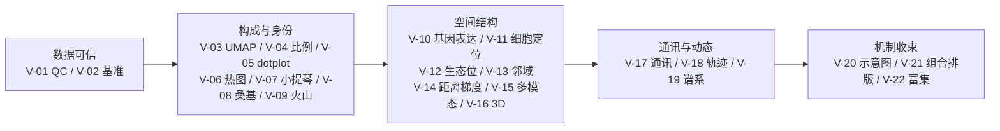

# 07 · 绘图与呈现（图语法）

> 一张图 = 论证链上的一环。"图是为了说明什么问题"是本层的第一问题——先定位问题，再选图型、找参考、画合规。

## 论证链与图型地图

一篇 Xenium 论文的图，几乎都沿这条链展开（括号=对应图型卡）：

**实证依据**：91 篇文献 269 条"绘图借鉴"（[图形类型书目](01_资料库/图形类型书目.csv)）——空间细胞定位 33 条、空间域 27 条、空间基因表达 24 条、机制示意图 21 条、通讯 20 条、距离分箱 20 条是六大主力图型。

## 每张图回答什么问题（速查）

| 论证问题 | 图型卡 |
|---|---|
| 这份数据/方法可信吗？ | V-01 QC、V-02 基准、V-15 多模态对齐 |
| 样本里有哪些细胞、比例如何？ | V-03 UMAP、V-04 比例、V-05 dotplot、V-06 热图 |
| 基因/细胞在组织里哪儿？ | V-10 基因表达、V-11 细胞定位、V-16 3D |
| 微环境怎么分区、谁挨着谁显著吗？ | V-12 生态位、V-13 邻域、V-14 距离梯度 |
| 状态怎么变、谁跟谁通讯、克隆怎么走？ | V-18 轨迹、V-17 通讯、V-19 谱系 |
| 这组差异/基因什么功能？ | V-09 火山、V-22 富集 |
| 全文支持什么模型？ | V-20 示意图、V-21 组合排版、V-08 桑基（构成流动叙事） |

## 三步用法

1. **定位**：打开 [绘图呈现 README](02_工作流开发/绘图呈现/README.md) 图语法总表 → 按你的论证问题找卡；读卡内"这张图回答什么问题"确认位置。
2. **动手**：按卡内"数据前提→工具选型→最佳参考仓"走；参考仓路径均经精读实测，可到 `03_开源项目/` 对应镜像仓看实现。
3. **合规自检**：画完对照卡内 zoro-figure 铁律编号逐条过；组织纪律走 PATTERN-045/050/028/006（产数/出图双层、图号反查手册、locked 命名、figures/<图号>/ 落盘）+ 三件套（PNG+PDF+CSV）。

## 两个关键认知（来自一期审计）

1. **图型选择有实证**：不要凭感觉堆图——六大主力图型占 269 条的近半；用户点名的桑基（3 条）与比例图（16 条）虽少但属组间比较刚需，照常做。
2. **图常见 ≠ 代码有**：细胞通讯图 20 条排第三，但 72 仓中无专门方法仓（[分类分析报告 §3.3](01_资料库/分类分析报告_一期.md)）——这类"图热码冷"的模块是二期迭代机会，画法参考 V-17 卡内弦图+空间落位双联范式。

## 交付契约（出图必读）

- 格式：PNG（≥300dpi）+ PDF 成对 + 同名 CSV 存图内所绘值（铁律 #9）。
- 命名：`两位序号_英文短名称`，不带 seed/final/v2（铁律 #10）。
- 落盘：`figures/<图号>/`（PATTERN-006）；终版 locked 命名（PATTERN-028）。
- 完整 12 条铁律与图面规范见 **zoro-figure 技能**（单一来源，本库只引用编号）。
